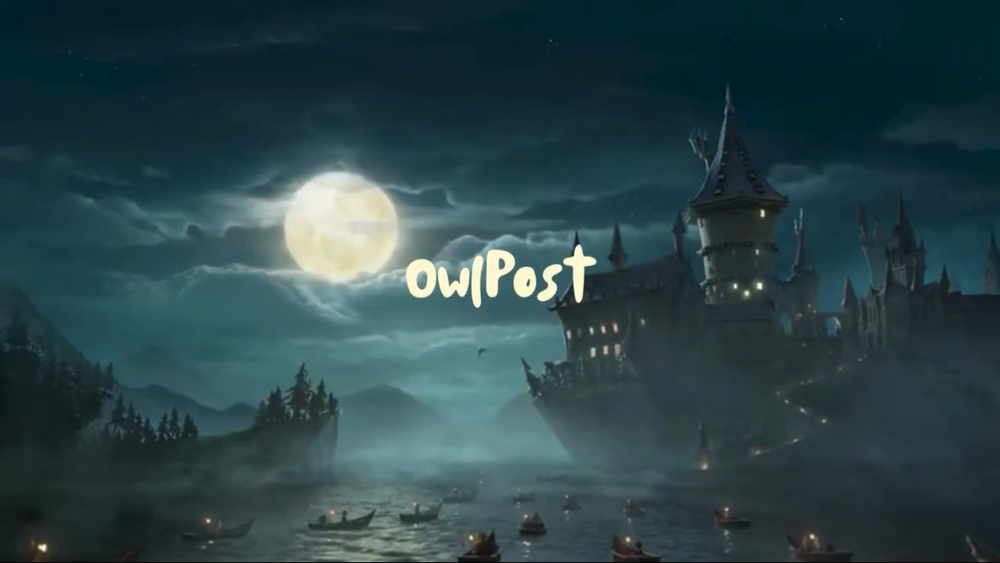
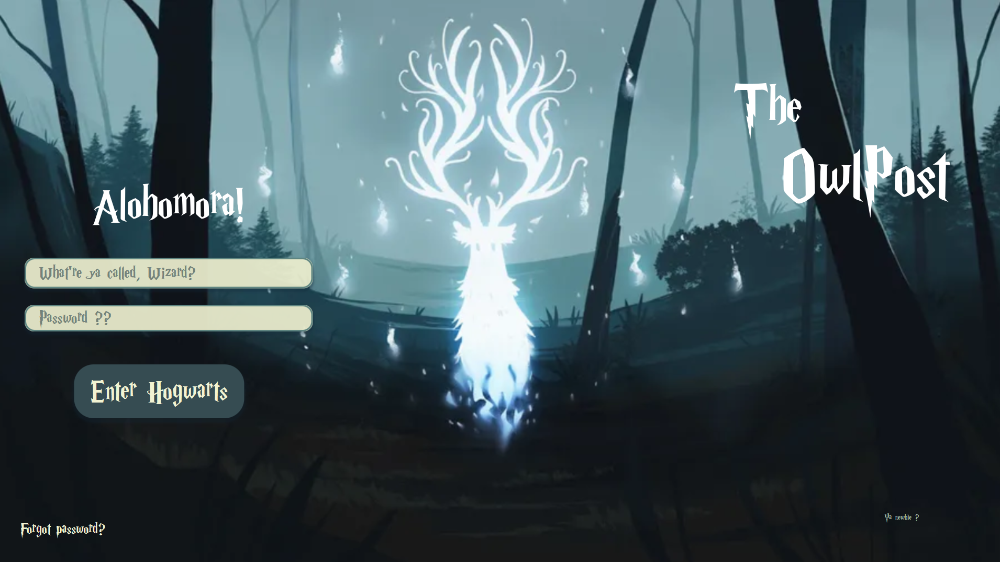
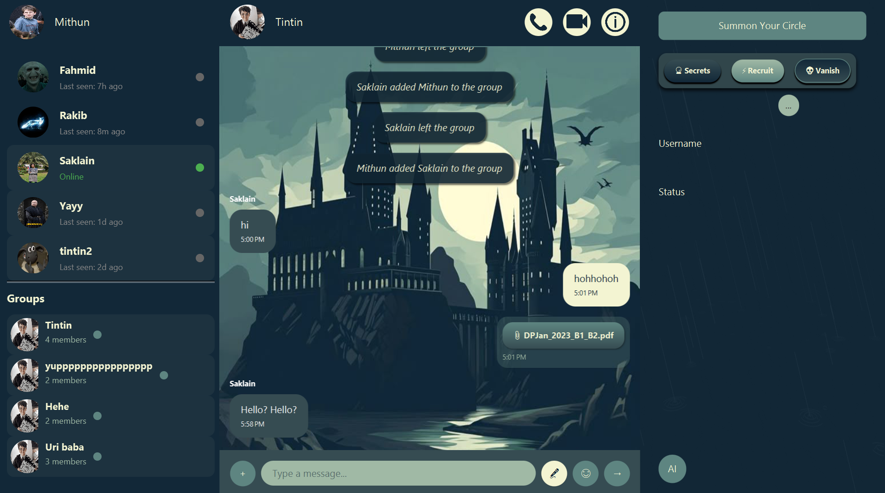

# The OwlPost

The OwlPost is a JavaFX-powered messaging application with a fun Harry Potter theme, offering secure, real-time chat, voice & video calls, AI integration, and even a networked tic-tac-toe game.

## Table of Contents

- [Overview](#overview)
- [Features](#features)
- [Screenshots](#screenshots)
- [Getting Started](#getting-started)
- [Project Structure](#project-structure)
- [Contributors](#contributors)
- [License](#license)
- [Acknowledgments](#acknowledgments)

## Overview

Inspired by the magical world of Hogwarts, The OwlPost delivers a lightweight, theme-driven messaging experience. Built in JavaFX and backed by a real-time database, it supports multiple user roles, secure authentication, group chats, multimedia messaging, voice/video calls, AI assistance, and even a mini tic-tac-toe game.

## Features

### 🔐 Authentication & User Info

- **Sign Up** with House sorting and age check (18–25)
- **Login system**
- **Forgot password** feature
- **Last seen** tracking
- **Online status** (real-time)
- **Real-time database** integration (e.g., Firebase) to keep chat history safe

### 📨 Messaging

- Send **text**, **emoji**, and **file** messages
- **Emoji palette**
- **Background audio** changes with time
- **Voice-to-text** transcription
- **Real-time group** loading and UI updates
- **Internet-enabled** text messaging

### 📞 Communication

- **Audio calls**
- **Video calls**
- **Voice recognition**
- **AI assistant** API integration

### 🧑‍🤝‍🧑 Group Features

- Create **custom groups**
- **Real-time** group messaging with dynamic UI changes
- **Group info** panel (member list, etc.)
- **Add/leave** groups anytime with live updates
- **Timestamps** and **sender labels** on every message
- **System messages** for group events

### 🕹️ Games

- **Networked Tic-Tac-Toe** with challenge/request system

### 💬 Infrastructure & Performance

- **Threading** and **caching** for smooth, responsive UI

## Screenshots

Below are some screenshots of the application.
[](Screenshots/OwlPost.mp4)



## Getting Started

### Prerequisites

- Java 8 or higher
- JavaFX SDK
- Maven (bundled via the included wrapper)

### How to Run

1. **Clone** the repository
   ```bash
   git clone https://github.com/SaklainTheSpellbinder/TheOwlPost.git
   cd TheOwlPost
   ```
2. **Configure API keys**
   - Copy your AssemblyAI key into `assemblyaiAPI.txt`
   - Copy any other service key into `apikey.txt`
3. **Build** the project
   ```bash
   ./mvnw clean install
   ```
4. **Run** the application
   - In your IDE: import as a Maven project, ensure JavaFX is set up, then run the JavaFX `Application` class (the one extending `javafx.application.Application`).
   - Or via Maven:
     ```bash
     ./mvnw javafx:run
     ```

## Project Structure

```
TheOwlPost/
│
├── .idea/                    # IDE config files
├── src/
│   └── main/
│       ├── java/             # Java source (controllers, services, models)
│       └── resources/        # FXML layouts, CSS, audio assets
│
├── target/                   # Compiled artifacts
├── apikey.txt                # Gemini API key
├── assemblyaiAPI.txt         # AssemblyAI API key
├── owlpost.db                # SQLite database file
├── recording.wav             # Sample audio for testing
├── mvnw, mvnw.cmd            # Maven wrapper scripts
├── pom.xml                   # Maven project configuration
└── README.md                 # Project documentation
```

## Contributors

- [Saklain](https://github.com/SaklainTheSpellbinder)
- [Rakib](https://github.com/Rakib1958)

## License

This project is licensed under the MIT License. See the [LICENSE](LICENSE) file for details.

## Acknowledgments

- Inspired by the Harry Potter universe’s Owl Post system.
- Thanks to the open-source JavaFX community for libraries and guidance.

